# Лабораторная работа №6
## Система контроля версий
### Цель работы
Изучение базовых возможностей системы управления версиями, получение опыта работы с Git API, опыт работы с локальным и удаленным репозиторием.
### Ход работы
#### 1. Создание аккаунта на GitHub
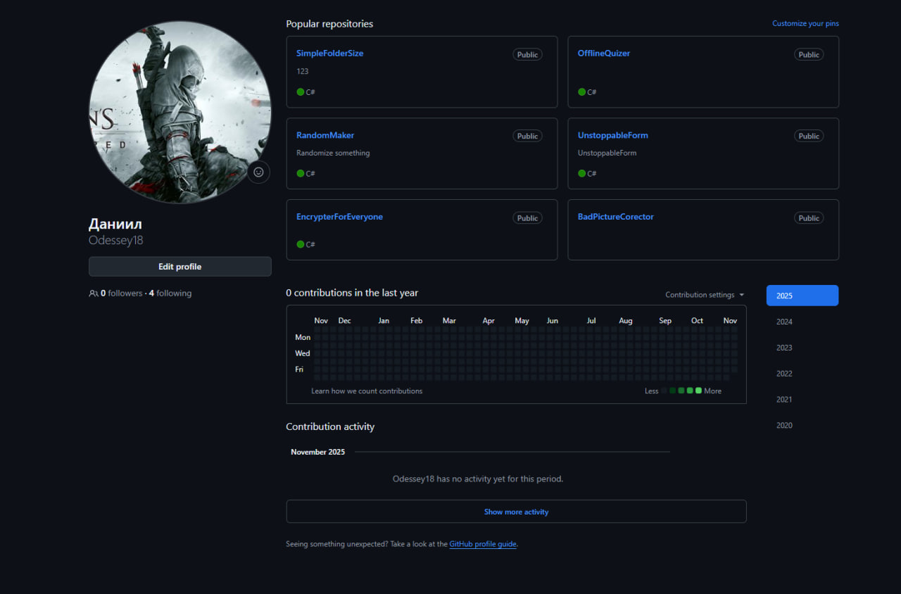
Создан аккаунт на сайте GitHub.
#### 2. Fork репозитория
Выполнен fork репозитория https://github.com/Kurtyanik/LR6/ в личное хранилище.
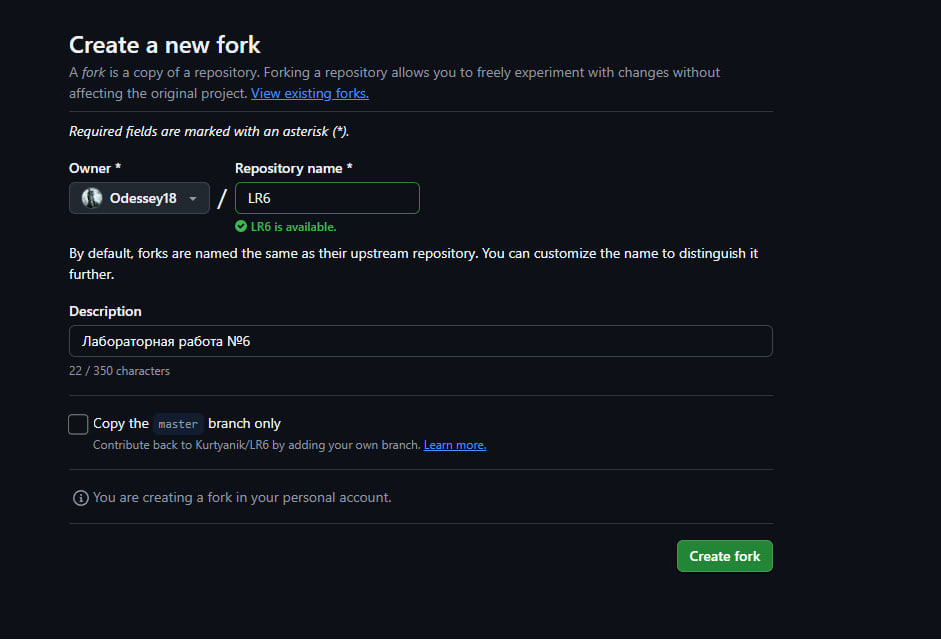
#### 3. Установка Git

#### 4. Настройка git
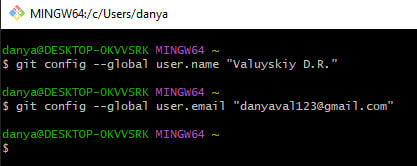
#### 5. Клонирование своего личного удалённый репозитория на компьютер
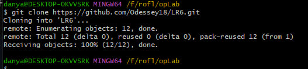
#### 6. Добавление файла через интерфейс GitHub. Подтянуть изменения в локальный репозиторий
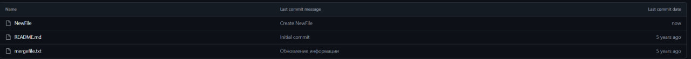
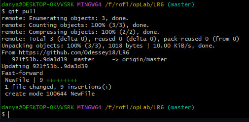
#### 7. Получена история операций
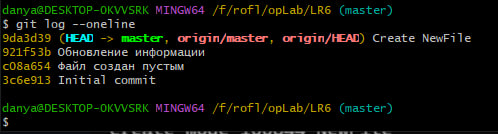
#### 8. Просмотрены последние изменения
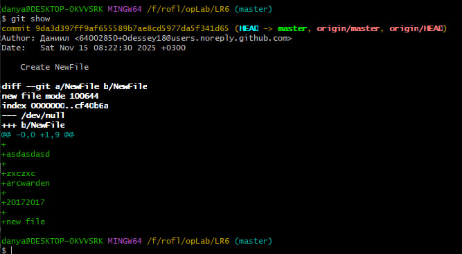
#### 9. Выполнено слияние веток
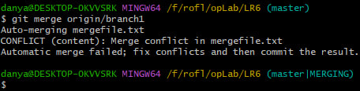
Конфликт слияния разрешен в программе pycharm объединением в один файл
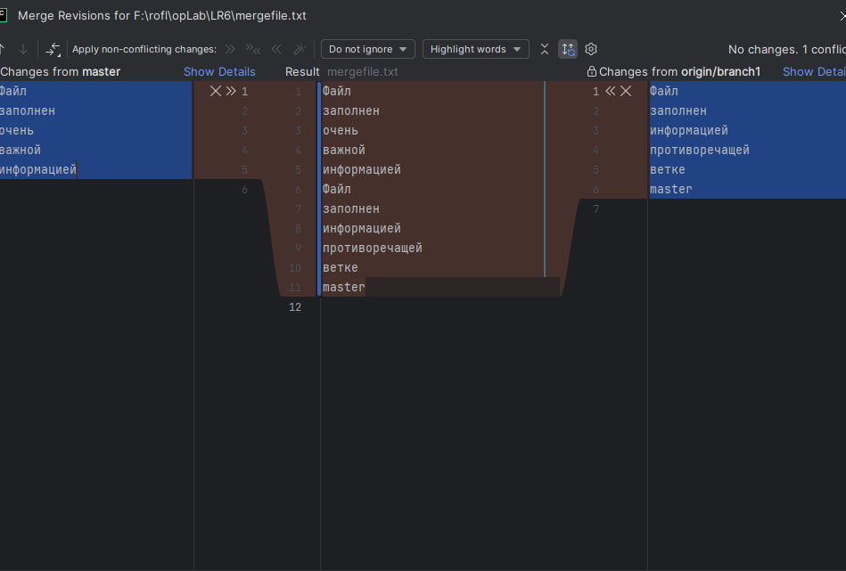
#### 10. Удалена побочная ветка
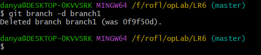
#### 11. Коммит измения(слияния)
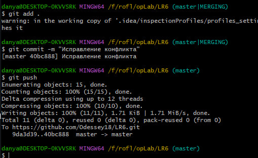
#### 12. Сделаны несколько изменений
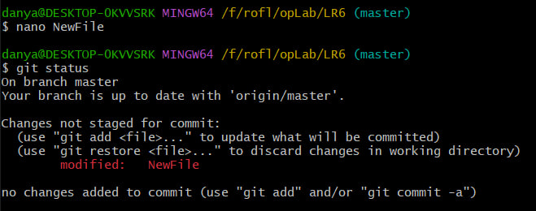
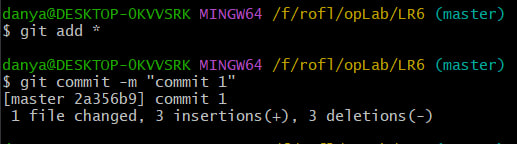
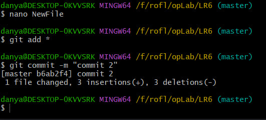
#### 13. Откат коммита
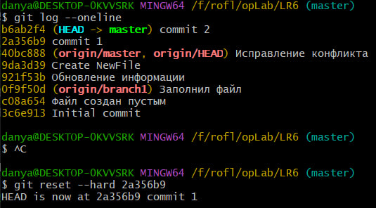
#### 14. Ветка для отчета
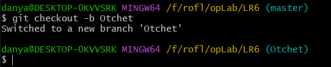
#### 15. Начало оформление отчета
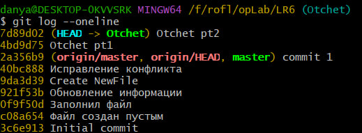
#### 16. Получена история операция в форматированном виде
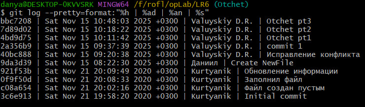
### Вывод
Изучил базовые возможности системы управления версиями, получил опыт работы с Git API, опыт работы с локальным и удаленным репозиторием. 